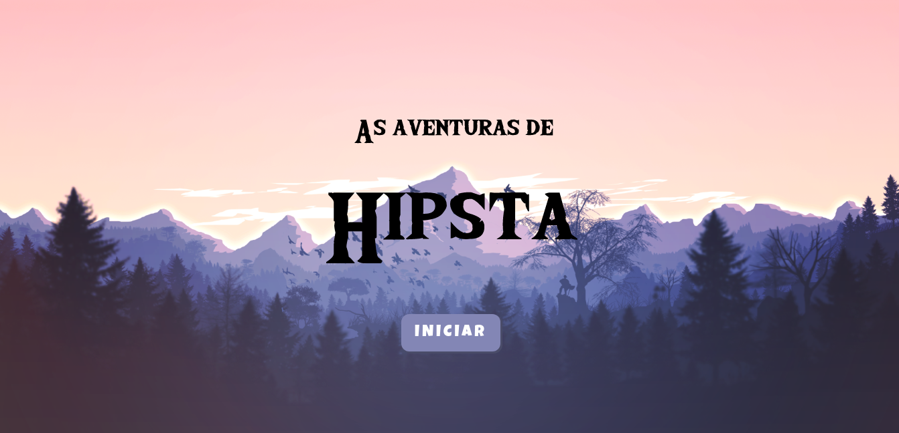

<h1 align="center">
  
<h1>

<h2 align="center">
  Jogo desenvolvido no projeto de imersão GameDev promovido pela Alura
</h2>

---

# Sobre o projeto
Este jogo foi desenvolvido usando apenas Javascript com o auxílio da lib [P5.js](https://p5js.org/), esse jogo é o resulado de um projeto de imersão da [Alura](https://www.alura.com.br/). O objetivo do jogo é fugir da floresta que está sendo atacada por criaturas terríveis!

O projeto original da imersão foi alterado para manter as configurações de layout no arquivo [tape.json](./src/tape/tape.json), deste modo você pode alterar todo o layout do jogo facilmente apenas editando esse arquivo. Use a propriedade mapa, no mesmo arquivo para criar a sequência de inimigos que a Hipsta deve enfrentar, a sequência é repetida ao final da lista.
